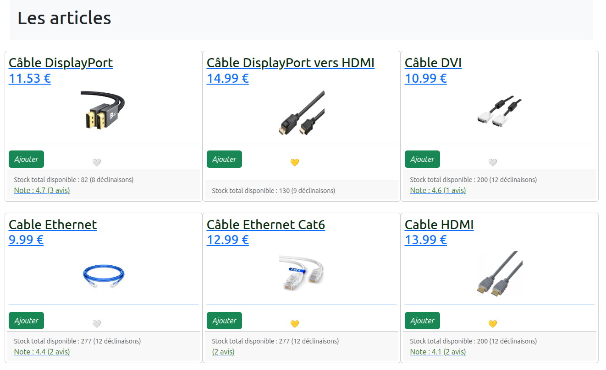

# PortfolioPro



## 📋 Description

PortfolioPro est un site web personnel moderne et responsive présentant mes compétences, projets et expériences professionnelles. Conçu avec une attention particulière à l'expérience utilisateur et à l'accessibilité, ce portfolio offre une interface élégante et interactive.

## ✨ Fonctionnalités

- **Design Responsive** : S'adapte parfaitement à tous les appareils (mobile, tablette, desktop)
- **Mode Sombre/Clair** : Interface adaptable aux préférences visuelles de l'utilisateur
- **Multilingue** : Support complet français/anglais
- **Animation Interactive** : Éléments animés pour une expérience utilisateur engageante
- **Accessibilité** : Conforme aux normes WCAG pour une meilleure accessibilité
- **Formulaire de Contact** : Permet aux visiteurs d'envoyer des messages directement
- **Galerie de Projets** : Présentation détaillée des projets avec filtres par catégorie
- **Timeline** : Chronologie interactive pour présenter mon parcours académique et professionnel

## 🛠️ Technologies Utilisées

- **HTML5** / **CSS3** / **JavaScript** (Vanilla)
- **Responsive Design** sans framework (CSS Grid & Flexbox)
- **Font Awesome** pour les icônes
- **Google Fonts** pour la typographie
- **ScrollReveal** pour les animations au défilement
- **Typed.js** pour l'effet de texte tapé

## 📱 Compatibilité

- Chrome (dernières versions)
- Firefox (dernières versions)
- Safari (dernières versions)
- Edge (dernières versions)
- Responsive sur mobile et tablette

## 🚀 Installation et Utilisation

1. Clonez ce dépôt :
   ```bash
   git clone https://github.com/aylanh45pro/PortfolioPro.git
   ```

2. Ouvrez le fichier `index.html` dans votre navigateur ou utilisez un serveur local comme Live Server (VSCode).

## 🔄 Personnalisation

Pour personnaliser ce portfolio pour votre propre usage :

1. Modifiez les informations personnelles dans `index.html`
2. Ajoutez vos propres projets dans la section projets
3. Mettez à jour les traductions dans `js/translations.js`
4. Personnalisez les styles dans les fichiers CSS du dossier `css/`
5. Remplacez les images dans le dossier `images/`

## 📄 Structure du Projet

```
├── index.html              # Page principale
├── css/                    # Styles CSS
│   ├── style.css           # Styles principaux
│   ├── dark-mode.css       # Styles pour le mode sombre
│   ├── loading.css         # Styles pour l'écran de chargement
│   ├── timeline.css        # Styles pour la timeline
│   └── modal-carousel.css  # Styles pour les modales et carousel
├── js/                     # Scripts JavaScript
│   ├── main.js             # Script principal
│   ├── translations.js     # Traductions FR/EN
│   ├── dark-mode.js        # Gestion du mode sombre
│   ├── loading.js          # Écran de chargement
│   ├── hero-animation.js   # Animation de la section hero
│   ├── accessibility.js    # Fonctionnalités d'accessibilité
│   ├── timeline.js         # Fonctionnalités de la timeline
│   └── modal-carousel.js   # Gestion des modales et carousel
└── images/                 # Images et ressources graphiques
```

## 🔗 Liens

- [Portfolio en ligne](https://aylanh45pro.github.io/PortfolioPro/)
- [GitHub](https://github.com/aylanh45pro)
- [LinkedIn](https://www.linkedin.com/in/aylan-haddouchi-a60768309/)

## 📝 Licence

Ce projet est sous licence MIT - voir le fichier [LICENSE](LICENSE) pour plus de détails.

## 👤 Contact

Aylan Haddouchi - [aylan.haddouchi@edu.univ-fcomte.fr](mailto:aylan.haddouchi@edu.univ-fcomte.fr)

---

© 2025 Aylan Haddouchi. Tous droits réservés.
